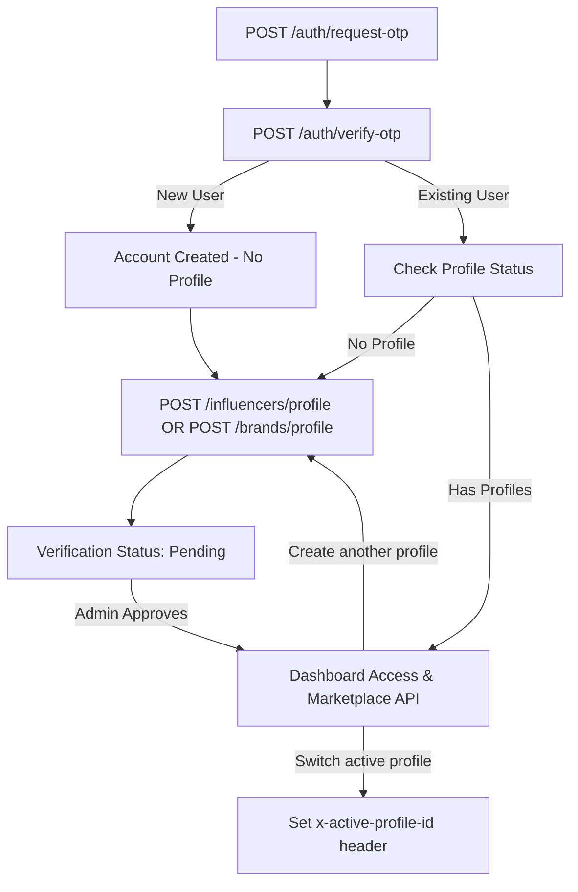

# RichyReach Backend API Reference & Specifications

This document serves as the absolute source of truth for the RichyReach REST API. All endpoints are documented with exact request payloads, success response bodies, and structured error responses.

---

## 1. Global Setup & Communication Standards

### 1.1 Base URL
All API endpoints are hosted under the `/api` prefix.
*   **Production**: `https://backend-api.richyreach.com/api`
*   **Local Development**: `http://localhost:8787/api`

### 1.2 Standard Success Response
All successful API responses return a `200 OK` or `201 Created` status code and wrap their payloads in a standardized structure:
```json
{
  "success": true,
  "message": "Operation completed successfully",
  "data": {
    // Response payload object or array
  },
  "meta": {
    // Optional metadata (e.g. pagination)
    "pagination": {
      "total": 45,
      "limit": 10,
      "offset": 0,
      "hasMore": false
    }
  }
}
```

### 1.3 Standard Error Responses

#### 400 Bad Request / Validation Failure
Returned when input parameters fail Zod schema validation.
```json
{
  "success": false,
  "error": "Validation failed",
  "meta": {
    "details": {
      "identifier": {
        "_errors": ["Email or phone number is required"]
      }
    }
  }
}
```

#### 401 Unauthorized
Returned when authentication credentials (session token or cookie) are missing, expired, or invalid.
```json
{
  "success": false,
  "error": "Unauthorized"
}
```

#### 403 Forbidden
Returned when an authenticated user attempts to access an endpoint restricted to another role.
```json
{
  "success": false,
  "error": "Forbidden: Access denied"
}
```

#### 404 Not Found
Returned when the requested resource (user, profile, campaign, etc.) does not exist.
```json
{
  "success": false,
  "error": "Resource not found"
}
```

#### 500 Internal Server Error
Returned when the backend encounters an unexpected server-side exception.
```json
{
  "success": false,
  "error": "Failed to complete operation due to an internal server error"
}
```

### 1.4 Authentication Header
All protected endpoints require a session token passed in one of two ways:
*   **Bearer Token**: `Authorization: Bearer <token>`
*   **Cookie**: `reelio_session=<token>`

### 1.5 Active Profile Header (Multiple Profiles)

> **Important**: A single user account can own **multiple** brand profiles and **multiple** influencer profiles. To specify which profile should perform an action (e.g., create a campaign, apply to a campaign), pass the `x-active-profile-id` header.

*   **Header Name**: `x-active-profile-id`
*   **Header Value**: The `id` of the brand or influencer profile (e.g., `bp_abc123` or `ip_xyz789`)
*   **Fallback behavior**: If the header is **not provided**, the system automatically uses the user's **first created** profile of the required type.
*   **Error**: If the provided `x-active-profile-id` does not belong to the authenticated user, a `400` error is returned.

**Example Header:**
```
x-active-profile-id: bp_45678
```

---

## 2. Authentication & Onboarding Lifecycle (`/auth`)

Users must register an account first. Once registered, they create one or more profiles (`/influencers/profile` or `/brands/profile`) before performing role-specific actions. A user can create multiple profiles of the same or different types.



### 2.1 Request Verification OTP
*   **Route**: `POST /auth/request-otp`
*   **Auth Required**: No
*   **Request Body**:
    ```json
    {
      "identifier": "user@example.com",
      "method": "email",
      "mode": "signup"
    }
    ```
    | Field | Type | Required | Description |
    |---|---|---|---|
    | `identifier` | string | Yes | Email address or phone number |
    | `method` | `"email"` \| `"whatsapp"` | Yes | Delivery method |
    | `mode` | `"login"` \| `"signup"` | No | Defaults to both |

*   **Success Response (200 OK)**:
    ```json
    {
      "success": true,
      "message": "Verification OTP sent successfully",
      "data": {
        "identifier": "user@example.com",
        "method": "email"
      }
    }
    ```
*   **Error Response (404 Not Found — mode `login` for non-existent user)**:
    ```json
    {
      "success": false,
      "error": "Account not found. Please register first."
    }
    ```

### 2.2 Verify OTP & Authenticate
*   **Route**: `POST /auth/verify-otp`
*   **Auth Required**: No
*   **Request Body**:
    ```json
    {
      "identifier": "user@example.com",
      "code": "123456",
      "role": "influencer",
      "name": "Jane Doe"
    }
    ```
    | Field | Type | Required | Description |
    |---|---|---|---|
    | `identifier` | string | Yes | Email or phone used in OTP request |
    | `code` | string | Yes | Exactly 6-digit OTP code |
    | `role` | `"influencer"` \| `"brand"` \| `"admin"` | Yes (signup) | Role assigned to new users |
    | `name` | string | No | Display name for new users |

*   **Success Response (200 OK)**:
    ```json
    {
      "success": true,
      "message": "Authentication successful",
      "data": {
        "token": "a1b2c3d4-e5f6-7a8b-9c0d-e1f2a3b4c5d6",
        "isNewUser": true,
        "user": {
          "id": "usr_78910",
          "name": "Jane Doe",
          "email": "user@example.com",
          "role": "influencer",
          "image": "https://api.dicebear.com/7.x/adventurer/svg?seed=Jane%20Doe"
        }
      }
    }
    ```
*   **Error Response (400 Bad Request — Expired/Invalid Code)**:
    ```json
    {
      "success": false,
      "error": "Invalid or expired verification code"
    }
    ```

### 2.3 Get Active Session
*   **Route**: `GET /auth/session`
*   **Auth Required**: Yes
*   **Success Response (200 OK)**:
    ```json
    {
      "success": true,
      "message": "Active session retrieved",
      "data": {
        "session": {
          "id": "sess_uuid123",
          "userId": "usr_78910",
          "expiresAt": "2026-07-10T13:29:47.000Z"
        },
        "user": {
          "id": "usr_78910",
          "name": "Jane Doe",
          "email": "user@example.com",
          "role": "influencer",
          "image": "https://api.dicebear.com/7.x/adventurer/svg?seed=Jane%20Doe"
        }
      }
    }
    ```
*   **Error Response (401 Unauthorized)**:
    ```json
    {
      "success": false,
      "error": "Invalid or expired session"
    }
    ```

### 2.4 Logout Session
*   **Route**: `POST /auth/logout`
*   **Auth Required**: Yes
*   **Success Response (200 OK)**:
    ```json
    {
      "success": true,
      "message": "Logged out successfully",
      "data": null
    }
    ```

### 2.5 WhatsApp Webhook (Magic Link)
*   **Route**: `POST /auth/whatsapp-webhook`
*   **Auth Required**: No
*   **Request Body**:
    ```json
    {
      "mobileNumber": "+919999999999",
      "keyword": "signin"
    }
    ```
*   **Success Response (200 OK — Existing User)**:
    ```json
    {
      "success": true,
      "message": "Auto signin URL generated",
      "data": {
        "signinUrl": "https://richyreach.expo.app/magic-login?token=sess_token_uuid",
        "mobileNumber": "+919999999999",
        "isNewUser": false
      }
    }
    ```
*   **Success Response (200 OK — New User Redirect)**:
    ```json
    {
      "success": true,
      "message": "User not found, redirecting to onboarding",
      "data": {
        "signinUrl": "https://richyreach.expo.app/onboarding",
        "mobileNumber": "+919999999999",
        "isNewUser": true
      }
    }
    ```

---

## 3. Brand Directory & Dashboard Operations (`/brands`)

All endpoints in this section require authentication. A single user can own **multiple** brand profiles. Use the `x-active-profile-id` header to specify which profile to operate on. If omitted, the first profile is used.

### 3.1 Create or Update Brand Profile

Creates a **new** brand profile if no `id` is provided, or **updates** an existing one if `id` is included. Automatically fills missing fields (logo, category, description) by scraping the website metadata.

*   **Route**: `POST /brands/profile` or `PUT /brands/profile`
*   **Auth Required**: Yes (`brand` role)
*   **Request Body**:
    ```json
    {
      "id": "bp_45678",
      "companyName": "Brand Inc.",
      "website": "https://brand.com",
      "logo": "https://brand.com/logo.png",
      "category": "Fashion",
      "description": "Premium clothing brand"
    }
    ```
    | Field | Type | Required | Description |
    |---|---|---|---|
    | `id` | string | **No** | Omit to create a new profile; include to update an existing one |
    | `companyName` | string | Yes | Brand display name |
    | `website` | string | Yes | Must be a valid URL |
    | `logo` | string \| null | No | Logo URL (auto-scraped from website if absent) |
    | `category` | string | Yes | Business category (e.g. `"Fashion"`, `"Tech"`) |
    | `description` | string \| null | No | Brand description (auto-scraped from website if absent) |

*   **Success Response (200 OK — Update) / (201 Created — New)**:
    ```json
    {
      "success": true,
      "message": "Brand profile updated successfully",
      "data": {
        "id": "bp_45678",
        "userId": "usr_brand123",
        "companyName": "Brand Inc.",
        "website": "https://brand.com",
        "logo": "https://brand.com/logo.png",
        "category": "Fashion",
        "description": "Premium clothing brand",
        "status": "pending",
        "verified": false,
        "createdAt": "2026-06-10T13:29:47.000Z",
        "updatedAt": "2026-06-10T13:29:47.000Z"
      }
    }
    ```
*   **Error Response (404 — No profile to update with given `id`)**:
    ```json
    {
      "success": false,
      "error": "Brand profile not found or does not belong to you."
    }
    ```

### 3.2 Get Active Brand Profile
Returns the brand profile currently resolved from the `x-active-profile-id` header (or the first profile as fallback).

*   **Route**: `GET /brands/profile`
*   **Auth Required**: Yes (`brand` role)
*   **Header (optional)**: `x-active-profile-id: bp_45678`
*   **Success Response (200 OK)**:
    ```json
    {
      "success": true,
      "message": "Brand profile retrieved successfully",
      "data": {
        "id": "bp_45678",
        "userId": "usr_brand123",
        "companyName": "Brand Inc.",
        "website": "https://brand.com",
        "logo": "https://brand.com/logo.png",
        "category": "Fashion",
        "description": "Premium clothing brand",
        "brandSize": "smb",
        "budgetRange": "mid",
        "instagramPage": "@brandInc",
        "status": "verified",
        "verified": true,
        "createdAt": "2026-06-09T10:00:00.000Z",
        "updatedAt": "2026-06-10T13:29:47.000Z"
      }
    }
    ```
*   **Error Response (404 — No brand profile exists yet)**:
    ```json
    {
      "success": false,
      "error": "Brand profile required. Please create a brand profile first."
    }
    ```

### 3.3 List All Brand Profiles (for the logged-in user)
Returns all brand profiles owned by the current user. Use this to build a profile-switcher UI.

*   **Route**: `GET /brands/profiles`
*   **Auth Required**: Yes (`brand` role)
*   **Success Response (200 OK)**:
    ```json
    {
      "success": true,
      "message": "Brand profiles retrieved successfully",
      "data": [
        {
          "id": "bp_45678",
          "userId": "usr_brand123",
          "companyName": "Brand Inc.",
          "website": "https://brand.com",
          "logo": "https://brand.com/logo.png",
          "category": "Fashion",
          "status": "verified",
          "verified": true,
          "createdAt": "2026-06-09T10:00:00.000Z"
        },
        {
          "id": "bp_99001",
          "userId": "usr_brand123",
          "companyName": "TechGear Co.",
          "website": "https://techgear.com",
          "logo": "https://techgear.com/logo.png",
          "category": "Technology",
          "status": "pending",
          "verified": false,
          "createdAt": "2026-06-10T08:00:00.000Z"
        }
      ]
    }
    ```

### 3.4 Get Dashboard Metrics
Provides a rollup of campaign performance, spending, and total applicants for the active brand profile.

*   **Route**: `GET /brands/dashboard`
*   **Auth Required**: Yes (`brand` role)
*   **Header (optional)**: `x-active-profile-id: bp_45678`
*   **Success Response (200 OK)**:
    ```json
    {
      "success": true,
      "message": "Dashboard data retrieved successfully",
      "data": {
        "activeCampaigns": 3,
        "totalSpend": 1500000,
        "totalReach": 250000,
        "campaigns": [
          {
            "id": "camp_abc123",
            "brandId": "bp_45678",
            "title": "Summer Reel Promo",
            "budget": 50000,
            "campaignType": "reel",
            "status": "active",
            "createdAt": "2026-06-10T12:00:00.000Z"
          }
        ],
        "influencerStats": {
          "totalApplicants": 12,
          "totalInvitesSent": 8
        }
      }
    }
    ```

### 3.5 Get Saved Influencer Profiles
*   **Route**: `GET /brands/saved-influencers`
*   **Auth Required**: Yes (`brand` role)
*   **Header (optional)**: `x-active-profile-id: bp_45678`
*   **Success Response (200 OK)**:
    ```json
    {
      "success": true,
      "message": "Saved influencers retrieved",
      "data": [
        {
          "savedId": "saved_999",
          "id": "ip_78910",
          "name": "Jane Doe",
          "avatar": "https://avatar.url",
          "bio": "Lifestyle content creator",
          "instagramHandle": "jane_travels",
          "followers": 150000,
          "engagementRate": 4.5,
          "niche": "Travel & Lifestyle",
          "avgViews": 45000,
          "pricing": 25000,
          "verified": true,
          "level": "mid",
          "reachScore": 82,
          "country": "India"
        }
      ]
    }
    ```

### 3.6 Bookmark Influencer Profile
*   **Route**: `POST /brands/save-influencer`
*   **Auth Required**: Yes (`brand` role)
*   **Header (optional)**: `x-active-profile-id: bp_45678`
*   **Request Body**:
    ```json
    {
      "influencerId": "ip_78910"
    }
    ```
    > **Note**: `influencerId` here is the **influencer profile ID** (not the user ID).
*   **Success Response (200 OK)**:
    ```json
    {
      "success": true,
      "message": "Influencer saved",
      "data": {
        "id": "saved_999",
        "brandId": "bp_45678",
        "influencerId": "ip_78910"
      }
    }
    ```

### 3.7 Remove Bookmarked Influencer
*   **Route**: `DELETE /brands/save-influencer/:influencerId`
*   **Auth Required**: Yes (`brand` role)
*   **Success Response (200 OK)**:
    ```json
    {
      "success": true,
      "message": "Influencer unsaved",
      "data": { "success": true }
    }
    ```

---

## 4. Campaign Management APIs (`/campaigns`)

Campaign routing is reserved for authenticated brands. All campaigns are tied to a specific **brand profile** (not a user). Use `x-active-profile-id` to specify which brand profile creates or manages a campaign.

### 4.1 Launch Campaign (Standard / Arena)
Creates a new active campaign linked to the active brand profile. A campaign image template is automatically selected based on category.

*   **Route**: `POST /campaigns/create` or `POST /campaigns/advanced`
*   **Auth Required**: Yes (`brand` role)
*   **Header (optional)**: `x-active-profile-id: bp_45678`
*   **Request Body**:
    ```json
    {
      "title": "Summer Apparel Reels Campaign",
      "description": "Create one 30-second Reel showcasing our organic linen collection.",
      "budget": 75000,
      "campaignType": "reel",
      "targetAudience": "Eco-conscious Fashionistas, 18-34 years",
      "requirements": "Must feature logo, include discount code linen20, tag @brand",
      "expectedReach": 15000,
      "allowFraction": false,
      "isArena": false,
      "maxReachCap": null,
      "category": "Fashion"
    }
    ```
    | Field | Type | Required | Description |
    |---|---|---|---|
    | `title` | string | Yes | Campaign title (min 5 chars) |
    | `description` | string | Yes | Campaign brief |
    | `budget` | integer | Yes | Budget in USD cents (e.g. `75000` = $750.00) |
    | `campaignType` | string | Yes | `"reel"` \| `"story"` \| `"post"` \| `"long-term"` |
    | `targetAudience` | string | No | Audience description |
    | `requirements` | string | No | Creator requirements |
    | `expectedReach` | integer | No | Expected total reach |
    | `allowFraction` | boolean | No | Allow fractional deliverables |
    | `isArena` | boolean | No | Set `true` for leaderboard arena contest |
    | `maxReachCap` | integer \| null | No | Reach cap for arena contests |
    | `category` | string | No | Falls back to brand's category |

*   **Success Response (201 Created)**:
    ```json
    {
      "success": true,
      "message": "Campaign created successfully",
      "data": {
        "id": "camp_abc123",
        "brandId": "bp_45678",
        "title": "Summer Apparel Reels Campaign",
        "description": "Create one 30-second Reel showcasing our organic linen collection.",
        "budget": 75000,
        "campaignType": "reel",
        "targetAudience": "Eco-conscious Fashionistas, 18-34 years",
        "requirements": "Must feature logo, include discount code linen20, tag @brand",
        "allowFraction": false,
        "status": "active",
        "expectedReach": 15000,
        "isArena": false,
        "maxReachCap": null,
        "category": "Fashion",
        "campaignImageId": "ci_image_002",
        "createdAt": "2026-06-10T13:29:47.000Z"
      }
    }
    ```
*   **Error Response (400 — Validation failure)**:
    ```json
    {
      "success": false,
      "error": "Validation failed",
      "meta": {
        "details": {
          "title": { "_errors": ["Title must be at least 5 characters"] },
          "budget": { "_errors": ["Budget must be a positive integer in cents"] }
        }
      }
    }
    ```

### 4.2 Edit Campaign Parameters
*   **Route**: `PUT /campaigns/:id`
*   **Auth Required**: Yes (`brand` role)
*   **Request Body**:
    ```json
    {
      "title": "Updated Apparel Campaign",
      "budget": 80000,
      "status": "active"
    }
    ```
*   **Success Response (200 OK)**:
    ```json
    {
      "success": true,
      "message": "Campaign updated successfully",
      "data": {
        "id": "camp_abc123",
        "brandId": "bp_45678",
        "title": "Updated Apparel Campaign",
        "budget": 80000,
        "campaignType": "reel",
        "status": "active",
        "createdAt": "2026-06-10T13:29:47.000Z"
      }
    }
    ```

### 4.3 Delete Campaign
*   **Route**: `DELETE /campaigns/:id`
*   **Success Response (200 OK)**:
    ```json
    {
      "success": true,
      "message": "Campaign deleted successfully",
      "data": null
    }
    ```
*   **Error Response (404)**:
    ```json
    {
      "success": false,
      "error": "Campaign not found or not owned by this brand"
    }
    ```

### 4.4 List Brand's Campaigns
Returns campaigns belonging to the active brand profile.

*   **Route**: `GET /campaigns`
*   **Auth Required**: Yes (`brand` role)
*   **Header (optional)**: `x-active-profile-id: bp_45678`
*   **Success Response (200 OK)**:
    ```json
    {
      "success": true,
      "message": "Campaigns retrieved successfully",
      "data": [
        {
          "id": "camp_abc123",
          "title": "Summer Apparel Reels Campaign",
          "budget": 75000,
          "campaignType": "reel",
          "status": "active",
          "expectedReach": 15000,
          "category": "Fashion",
          "campaignImageId": "ci_image_002",
          "imageUrl": "https://res.cloudinary.com/.../apparel.jpg",
          "createdAt": "2026-06-10T13:29:47.000Z"
        }
      ]
    }
    ```

### 4.5 Get Campaign Details (with applicants/invites)
*   **Route**: `GET /campaigns/:id`
*   **Success Response (200 OK)**:
    ```json
    {
      "success": true,
      "message": "Campaign retrieved successfully",
      "data": {
        "campaign": {
          "id": "camp_abc123",
          "brandId": "bp_45678",
          "title": "Summer Apparel Reels Campaign",
          "description": "Create one Reel...",
          "budget": 75000,
          "campaignType": "reel",
          "allowFraction": false,
          "targetAudience": "Eco-conscious",
          "requirements": "Logo tag",
          "status": "active",
          "expectedReach": 15000,
          "isArena": false,
          "maxReachCap": null,
          "category": "Fashion",
          "campaignImageId": "ci_image_002",
          "imageUrl": "https://res.cloudinary.com/.../apparel.jpg",
          "createdAt": "2026-06-10T13:29:47.000Z"
        },
        "applications": [
          {
            "id": "app_99988",
            "proposal": "I would love to display this. I have 150k active travel fans.",
            "status": "pending",
            "createdAt": "2026-06-10T13:40:00.000Z",
            "influencerId": "ip_78910",
            "instagramHandle": "jane_travels",
            "followers": 150000,
            "engagementRate": 4.5,
            "name": "Jane Doe",
            "avatar": "https://avatar.url"
          }
        ],
        "invites": []
      }
    }
    ```

### 4.6 Invite Influencer to Campaign
*   **Route**: `POST /campaigns/invite`
*   **Auth Required**: Yes (`brand` role)
*   **Request Body**:
    ```json
    {
      "influencerId": "ip_78910",
      "campaignId": "camp_abc123"
    }
    ```
    > **Note**: `influencerId` is the **influencer profile ID** (prefix `ip_`), not the user ID.
*   **Success Response (201 Created)**:
    ```json
    {
      "success": true,
      "message": "Influencer invited successfully",
      "data": {
        "id": "invite_0011",
        "brandId": "bp_45678",
        "influencerId": "ip_78910",
        "campaignId": "camp_abc123",
        "status": "pending",
        "createdAt": "2026-06-10T13:29:47.000Z"
      }
    }
    ```

---

## 5. Influencer Marketplace & Work APIs (`/influencers`)

Influencers manage profiles, services, applications, and sync social metrics from Instagram. A single user can own **multiple** influencer profiles (e.g., one per niche or Instagram handle). Use `x-active-profile-id` to select the active profile.

### 5.1 Public Marketplace Directory
Supports pagination, query sorting, level categorization, budget ranges, and search keywords.

*   **Route**: `GET /influencers`
*   **Auth Required**: No (Rate-limited public endpoint)
*   **Query Parameters**:
    | Param | Type | Description |
    |---|---|---|
    | `niche` | string | e.g. `Lifestyle` |
    | `level` | string | `nano` \| `micro` \| `mid` \| `macro` \| `mega` |
    | `minFollowers` | integer | e.g. `10000` |
    | `maxPricing` | integer | e.g. `50000` |
    | `search` | string | Keyword search |
    | `limit` | integer | Page size (default `10`) |
    | `offset` | integer | Pagination offset (default `0`) |

*   **Success Response (200 OK)**:
    ```json
    {
      "success": true,
      "data": [
        {
          "id": "ip_78910",
          "name": "Jane Doe",
          "email": "user@example.com",
          "avatar": "https://avatar.url",
          "bio": "Lifestyle content creator",
          "instagramHandle": "jane_travels",
          "followers": 150000,
          "engagementRate": 4.5,
          "niche": "Travel & Lifestyle",
          "avgViews": 45000,
          "avgLikes": 6750,
          "pricing": 25000,
          "verified": true,
          "level": "mid",
          "reachScore": 82,
          "country": "India",
          "postingFrequency": 4.2,
          "growthRate": 3.1
        }
      ],
      "message": "Influencers fetched successfully",
      "meta": {
        "pagination": {
          "total": 1,
          "limit": 10,
          "offset": 0,
          "hasMore": false
        }
      }
    }
    ```

### 5.2 Get Single Influencer Profile by ID (Public)
*   **Route**: `GET /influencers/:id`
*   **Auth Required**: No
*   **Success Response (200 OK)**: Same shape as one item in the marketplace directory.

### 5.3 Create or Update Influencer Profile
Creates a **new** influencer profile if no `id` is provided, or **updates** an existing one if `id` is included. Triggers auto-scraping of Instagram demographics (followers, engagement rate, average views) based on the handle.

*   **Route**: `POST /influencers/profile` or `PUT /influencers/profile`
*   **Auth Required**: Yes (`influencer` role)
*   **Header (optional)**: `x-active-profile-id: ip_78910`
*   **Request Body**:
    ```json
    {
      "id": "ip_78910",
      "instagramHandle": "jane_travels",
      "pricing": 25000,
      "niche": "Travel",
      "skills": ["Mobile Videography", "Storyboarding"],
      "country": "India",
      "socialLinks": {
        "youtube": "https://youtube.com/@jane",
        "tiktok": "https://tiktok.com/@jane"
      },
      "portfolioItems": [
        {
          "mediaUrl": "https://res.cloudinary.com/.../post1.mp4",
          "mediaType": "video",
          "title": "Summer Adventure Vlog",
          "description": "Sponsored travel short reel"
        }
      ]
    }
    ```
    | Field | Type | Required | Description |
    |---|---|---|---|
    | `id` | string | **No** | Omit to create a new profile; include to update an existing one |
    | `instagramHandle` | string | Yes | Without `@` prefix |
    | `pricing` | integer | Yes | In USD cents (e.g. `25000` = $250.00) |
    | `niche` | string | Yes | Content niche category |
    | `skills` | string[] | No | List of skills |
    | `country` | string | No | 2-letter ISO or full country name |
    | `socialLinks` | object | No | Key-value map of social platform → URL |
    | `portfolioItems` | array | No | Array of portfolio media objects |

*   **Success Response (200 OK)**:
    ```json
    {
      "success": true,
      "message": "Influencer profile updated successfully",
      "data": {
        "id": "ip_78910",
        "userId": "usr_78910",
        "name": "Jane Doe",
        "avatar": "https://res.cloudinary.com/.../insta_avatar.jpg",
        "bio": "Explorer, videographer & travel enthusiast.",
        "instagramHandle": "jane_travels",
        "followers": 150000,
        "engagementRate": 4.5,
        "niche": "Travel",
        "avgViews": 45000,
        "avgLikes": 6750,
        "pricing": 25000,
        "verified": false,
        "level": "mid",
        "reachScore": 82,
        "country": "India",
        "socialLinks": {
          "youtube": "https://youtube.com/@jane",
          "tiktok": "https://tiktok.com/@jane"
        },
        "reachScoreBreakdown": {
          "followers": 75,
          "engagement": 45,
          "consistency": 85,
          "audienceQuality": 68,
          "growth": 50,
          "recentPerformance": 78
        },
        "skills": ["Mobile Videography", "Storyboarding"],
        "portfolio": [
          {
            "id": "port_001",
            "mediaUrl": "https://res.cloudinary.com/.../post1.mp4",
            "mediaType": "video",
            "title": "Summer Adventure Vlog",
            "description": "Sponsored travel short reel"
          }
        ]
      }
    }
    ```
*   **Error Response (400 — Instagram handle already in use)**:
    ```json
    {
      "success": false,
      "error": "This Instagram handle is already registered under a different account."
    }
    ```

### 5.4 Get Active Influencer Profile
Returns the influencer profile resolved by `x-active-profile-id` header or the first profile as fallback.

*   **Route**: `GET /influencers/profile`
*   **Auth Required**: Yes (`influencer` role)
*   **Header (optional)**: `x-active-profile-id: ip_78910`
*   **Success Response (200 OK)**: Same shape as `POST /influencers/profile` response data.
*   **Error Response (404)**:
    ```json
    {
      "success": false,
      "error": "Influencer profile required. Please create one first."
    }
    ```

### 5.5 List All Influencer Profiles (for the logged-in user)
Returns all influencer profiles owned by the current user. Use this to build a profile-switcher UI.

*   **Route**: `GET /influencers/profiles`
*   **Auth Required**: Yes (`influencer` role)
*   **Success Response (200 OK)**:
    ```json
    {
      "success": true,
      "message": "Influencer profiles retrieved successfully",
      "data": [
        {
          "id": "ip_78910",
          "userId": "usr_78910",
          "instagramHandle": "jane_travels",
          "followers": 150000,
          "niche": "Travel",
          "pricing": 25000,
          "level": "mid",
          "status": "verified",
          "verified": true,
          "createdAt": "2026-06-09T10:00:00.000Z"
        },
        {
          "id": "ip_99002",
          "userId": "usr_78910",
          "instagramHandle": "jane_codes",
          "followers": 22000,
          "niche": "Technology",
          "pricing": 8000,
          "level": "micro",
          "status": "pending",
          "verified": false,
          "createdAt": "2026-06-10T09:00:00.000Z"
        }
      ]
    }
    ```

### 5.6 Fetch Marketplace Campaigns (for application)
Returns public campaigns available to the active influencer profile, with application/saved/invite status flags.

*   **Route**: `GET /influencers/marketplace-campaigns`
*   **Auth Required**: Yes (`influencer` role)
*   **Header (optional)**: `x-active-profile-id: ip_78910`
*   **Query Parameters**:
    | Param | Type | Required | Description |
    |---|---|---|---|
    | `category` | string | No | Filter campaigns by brand's category |
    | `campaignType` | string | No | Filter campaigns by campaign type (e.g. `reel`, `story`) |
    | `search` | string | No | Keyword search (searches title and description) |
    | `limit` | integer | No | Pagination limit (default: 20) |
    | `offset` | integer | No | Pagination offset (default: 0) |
*   **Success Response (200 OK)**:
    ```json
    {
      "success": true,
      "message": "Marketplace campaigns fetched",
      "data": [
        {
          "id": "camp_abc123",
          "title": "Summer Apparel Reels Campaign",
          "description": "Create one Reel...",
          "budget": 75000,
          "campaignType": "reel",
          "targetAudience": "Eco-conscious",
          "requirements": "Logo tag",
          "status": "active",
          "expectedReach": 15000,
          "createdAt": "2026-06-10T13:29:47.000Z",
          "brandId": "bp_45678",
          "brandName": "Brand Inc.",
          "brandLogo": "https://logo.png",
          "brandCategory": "Fashion",
          "isApplied": false,
          "applicationStatus": null,
          "isSaved": false,
          "isInvited": false,
          "isRecommended": true
        }
      ]
    }
    ```

### 5.7 Saved / Bookmarked Campaigns

*   **`GET /influencers/saved-campaigns`** — Get saved campaigns for the active profile.
*   **`POST /influencers/save-campaign`** — Save a campaign. Body: `{"campaignId": "camp_abc123"}`.
*   **`DELETE /influencers/save-campaign/:campaignId`** — Unsave a campaign.

All endpoints respect `x-active-profile-id`.

*   **Success Response (200 OK — POST Save Campaign)**:
    ```json
    {
      "success": true,
      "message": "Campaign saved",
      "data": {
        "id": "sc_5678",
        "influencerId": "ip_78910",
        "campaignId": "camp_abc123"
      }
    }
    ```

### 5.8 Manage Creator Services
Creator services are scoped to the **active influencer profile**.

*   **`GET /influencers/services`** — List services for the active profile.
*   **`POST /influencers/services`** — Add a service (multipart form).
*   **`PUT /influencers/services/:id`** — Update a service.
*   **`DELETE /influencers/services/:id`** — Delete a service.

All endpoints respect `x-active-profile-id`.

*   **Request Body (`POST /influencers/services` — Multipart Form Data)**:

    | Field | Type | Required | Description |
    |---|---|---|---|
    | `name` | string | Yes | Service name |
    | `type` | string | Yes | Service type (must be strictly `"service"`) |
    | `price` | string | Yes | Price in INR (e.g. `"150.00"` → stored as `15000` paise) |
    | `deliveryTime` | string | No | e.g. `"5 days"` |
    | `exampleUrl` | string | No | External URL example |
    | `video` | File | No | Binary upload; uploaded to Cloudinary (populates both `exampleUrl` and `videoUrl`) |

*   **Success Response (200 OK — POST Service)**:
    ```json
    {
      "success": true,
      "data": {
        "id": "srv_555aa",
        "influencerProfileId": "ip_78910",
        "name": "Dedicated Instagram Reel Review",
        "type": "service",
        "price": 15000,
        "deliveryTime": "5 days",
        "exampleUrl": "https://res.cloudinary.com/.../service_video.mp4",
        "videoUrl": "https://res.cloudinary.com/.../service_video.mp4"
      }
    }
    ```

### 5.9 Sync Instagram Statistics
Triggers live sync of Instagram metrics for the active influencer profile.

*   **Route**: `POST /influencers/sync-instagram`
*   **Auth Required**: Yes (`influencer` role)
*   **Header (optional)**: `x-active-profile-id: ip_78910`
*   **Success Response (200 OK)**:
    ```json
    {
      "success": true,
      "message": "Instagram profile synced successfully",
      "data": {
        "instagramHandle": "jane_travels",
        "followers": 158000,
        "engagementRate": 4.8,
        "avgViews": 49000
      }
    }
    ```
*   **Error Response (404)**:
    ```json
    {
      "success": false,
      "error": "Influencer profile required. Please create one first."
    }
    ```

### 5.10 Get Influencer Dashboard Data
Returns earnings rollup, active/pending applications, and reach overview for the active influencer profile.

*   **Route**: `GET /influencers/dashboard`
*   **Auth Required**: Yes (`influencer` role)
*   **Header (optional)**: `x-active-profile-id: ip_78910`
*   **Success Response (200 OK)**:
    ```json
    {
      "success": true,
      "message": "Dashboard data retrieved successfully",
      "data": {
        "totalEarnings": 340000,
        "activeCampaigns": 2,
        "pendingApplications": 4,
        "analyticsOverview": {
          "totalReach": 180000,
          "monthlyViews": 45000,
          "averageEngagement": 4.8
        }
      }
    }
    ```

### 5.11 Submit Campaign Application
Submits an application for the active influencer profile.

*   **Route**: `POST /influencers/apply/:campaignId`
*   **Auth Required**: Yes (`influencer` role)
*   **Header (optional)**: `x-active-profile-id: ip_78910`
*   **Request Body**:
    ```json
    {
      "proposal": "I am a fashion creator and can post high-quality content targeting college-going users."
    }
    ```
*   **Success Response (201 Created)**:
    ```json
    {
      "success": true,
      "message": "Successfully applied to campaign",
      "data": {
        "id": "app_99988",
        "influencerId": "ip_78910",
        "campaignId": "camp_abc123",
        "proposal": "I am a fashion creator...",
        "status": "pending",
        "createdAt": "2026-06-10T13:29:47.000Z"
      }
    }
    ```
*   **Error Response (404 — Inactive or non-existent campaign)**:
    ```json
    {
      "success": false,
      "error": "Campaign not found"
    }
    ```

### 5.12 Get Influencer Campaigns (Applied)
*   **Route**: `GET /influencers/campaigns`
*   **Auth Required**: Yes (`influencer` role)
*   **Header (optional)**: `x-active-profile-id: ip_78910`
*   **Success Response (200 OK)**: Array of campaigns with the profile's application status.

### 5.13 Get Influencer Earnings
*   **Route**: `GET /influencers/earnings`
*   **Auth Required**: Yes (`influencer` role)
*   **Header (optional)**: `x-active-profile-id: ip_78910`
*   **Success Response (200 OK)**:
    ```json
    {
      "success": true,
      "message": "Earnings records retrieved successfully",
      "data": [
        {
          "id": "earn_001",
          "influencerId": "ip_78910",
          "amount": 50000,
          "source": "campaign",
          "status": "completed",
          "createdAt": "2026-06-09T10:00:00.000Z"
        }
      ]
    }
    ```

### 5.14 Get Influencer Analytics
*   **Route**: `GET /influencers/analytics`
*   **Auth Required**: Yes (`influencer` role)
*   **Header (optional)**: `x-active-profile-id: ip_78910`
*   **Success Response (200 OK)**: Aggregated analytics for the active profile.

---

## 6. Messaging & Chat APIs (`/chat`)

Real-time conversations between Brands, Influencers, and Support Admins. Chat rooms are linked to **brand profile IDs** and **influencer profile IDs**, not user IDs. The `x-active-profile-id` header determines which profile opens or views a chat room.

### 6.1 List Active Chat Rooms
Returns rooms for the active profile (resolved from header or fallback).

*   **Route**: `GET /chat/rooms`
*   **Auth Required**: Yes
*   **Header (optional)**: `x-active-profile-id: ip_78910`
*   **Success Response (200 OK — Influencer Session)**:
    ```json
    {
      "success": true,
      "message": "Chat rooms fetched successfully",
      "data": [
        {
          "roomId": "room_xyz987",
          "createdAt": "2026-06-10T12:00:00.000Z",
          "brandId": "bp_45678",
          "companyName": "Brand Inc.",
          "logo": "https://brand.com/logo.png"
        },
        {
          "roomId": "admin_adminchat_001",
          "createdAt": "2026-06-10T12:30:00.000Z",
          "brandId": "usr_78910",
          "companyName": "RichyReach Team",
          "logo": "https://api.dicebear.com/7.x/initials/svg?seed=RichyReach"
        }
      ]
    }
    ```
*   **Success Response (200 OK — Brand Session)**:
    ```json
    {
      "success": true,
      "message": "Chat rooms fetched successfully",
      "data": [
        {
          "roomId": "room_xyz987",
          "createdAt": "2026-06-10T12:00:00.000Z",
          "influencerId": "ip_78910",
          "instagramHandle": "jane_travels",
          "avatar": "https://avatar.url",
          "name": "Jane Doe"
        }
      ]
    }
    ```

### 6.2 Create Room (Brand to Creator)
Creates a direct message room between the **active brand profile** and a specific **influencer profile**. Optionally accepts a campaign application simultaneously.

*   **Route**: `POST /chat/room`
*   **Auth Required**: Yes (`brand` role)
*   **Header (optional)**: `x-active-profile-id: bp_45678`
*   **Request Body**:
    ```json
    {
      "influencerId": "ip_78910",
      "campaignId": "camp_abc123"
    }
    ```
    | Field | Type | Required | Description |
    |---|---|---|---|
    | `influencerId` | string | Yes | **Influencer profile ID** (e.g. `ip_78910`) |
    | `campaignId` | string | No | If provided, automatically accepts the influencer's application |

*   **Success Response (201 Created)**:
    ```json
    {
      "success": true,
      "message": "Chat room created successfully",
      "data": {
        "id": "room_xyz987",
        "brandId": "bp_45678",
        "influencerId": "ip_78910",
        "createdAt": "2026-06-10T13:29:47.000Z"
      }
    }
    ```
*   **Error Response (404 — No brand profile)**:
    ```json
    {
      "success": false,
      "error": "Brand profile required. Please create one first."
    }
    ```

### 6.3 Open Help Session Room with Support
Admin-initiated support chat room with a specific user.

*   **Route**: `POST /chat/admin/room`
*   **Auth Required**: Yes (`admin` role)
*   **Request Body**:
    ```json
    {
      "userId": "usr_78910"
    }
    ```
*   **Success Response (201 Created)**:
    ```json
    {
      "success": true,
      "message": "Admin chat room created successfully",
      "data": {
        "id": "adminchat_001",
        "userId": "usr_78910",
        "createdAt": "2026-06-10T13:29:47.000Z",
        "roomId": "admin_adminchat_001"
      }
    }
    ```

### 6.4 Get Messages in a Chat Room
*   **Route**: `GET /chat/messages/:roomId`
*   **Auth Required**: Yes
*   **Success Response (200 OK)**:
    ```json
    {
      "success": true,
      "message": "Messages fetched successfully",
      "data": [
        {
          "id": "msg_0001",
          "content": "Hi Jane, is the reel script ready?",
          "createdAt": "2026-06-10T13:00:00.000Z",
          "senderId": "usr_brand123",
          "senderName": "Brand Inc.",
          "senderAvatar": "https://brand.url/logo.png"
        }
      ]
    }
    ```

### 6.5 Send Chat Message
Notifications are automatically sent to the message recipient by looking up the owner `userId` of the corresponding profile.

*   **Route**: `POST /chat/message/:roomId`
*   **Auth Required**: Yes
*   **Request Body**:
    ```json
    {
      "content": "Yes! I will send the draft reels link by tomorrow evening."
    }
    ```
*   **Success Response (201 Created)**:
    ```json
    {
      "success": true,
      "message": "Message sent successfully",
      "data": {
        "id": "msg_0002",
        "roomId": "room_xyz987",
        "senderId": "usr_78910",
        "content": "Yes! I will send the draft reels link by tomorrow evening.",
        "createdAt": "2026-06-10T13:29:47.000Z"
      }
    }
    ```

---

## 7. Performance & Reach Calculators (`/calculator`)

Public utilities used by creators and brand managers to model ROI projections.

### 7.1 Calculate Projected Reach
*   **Route**: `POST /calculator/reach`
*   **Request Body**:
    ```json
    {
      "budget": 500,
      "influencerTier": "micro",
      "engagementRate": 4.5
    }
    ```
*   **Success Response (200 OK)**:
    ```json
    {
      "success": true,
      "message": "Reach metrics calculated successfully",
      "data": {
        "expectedReach": 28333,
        "estimatedImpressions": 33333,
        "expectedClicks": 75,
        "engagementEstimate": 1500
      }
    }
    ```

### 7.2 Calculate Expected Creator Earnings
*   **Route**: `POST /calculator/earnings`
*   **Request Body**:
    ```json
    {
      "followers": 25000,
      "engagementRate": 5.2,
      "niche": "Technology"
    }
    ```
*   **Success Response (200 OK)**:
    ```json
    {
      "success": true,
      "message": "Earnings potential calculated successfully",
      "data": {
        "estimatedReelPrice": 458,
        "estimatedStoryPrice": 183,
        "monthlyEarningsPotential": 1648
      }
    }
    ```

---

## 8. Wallet Operations & Razorpay / Stripe Payments (`/wallet` & `/payments`)

### 8.1 Get User Wallet Balance & Statement
*   **Route**: `GET /wallet`
*   **Success Response (200 OK)**:
    ```json
    {
      "success": true,
      "data": {
        "balance": 50000,
        "transactions": [
          {
            "id": "tx_welcome_bonus",
            "userId": "usr_78910",
            "amount": 50000,
            "type": "credit",
            "description": "Welcome Bonus",
            "reference": "sign_up",
            "status": "completed",
            "createdAt": "2026-06-10T13:00:00.000Z"
          }
        ]
      }
    }
    ```

### 8.2 Create Razorpay Checkout Order (Top-Up)
*   **Route**: `POST /wallet/create-order`
*   **Request Body**:
    ```json
    {
      "amount": 100000
    }
    ```
*   **Success Response (200 OK)**:
    ```json
    {
      "success": true,
      "data": {
        "id": "order_PKx55588",
        "amount": 100000,
        "currency": "INR",
        "receipt": "rcpt_17179000_usr_78910",
        "key_id": "rzp_test_keyID"
      }
    }
    ```

### 8.3 Verify Razorpay Deposit Signature
*   **Route**: `POST /wallet/verify`
*   **Request Body**:
    ```json
    {
      "razorpay_order_id": "order_PKx55588",
      "razorpay_payment_id": "pay_PKx_payment123",
      "razorpay_signature": "abcdef123456789...",
      "amount": 100000
    }
    ```
*   **Success Response (200 OK)**:
    ```json
    {
      "success": true,
      "data": {
        "balance": 150000
      }
    }
    ```

### 8.4 Create Campaign Escrow Checkout (Stripe)
*   **Route**: `POST /payments/create`
*   **Request Body**:
    ```json
    {
      "campaignId": "camp_abc123",
      "amount": 75000
    }
    ```
*   **Error Response (500 — Stripe pending integration)**:
    ```json
    {
      "success": false,
      "error": "Stripe integration not implemented yet. Cannot create real payment session."
    }
    ```

---

## 9. Notification Center (`/notifications`)

### 9.1 List User Notifications
*   **Route**: `GET /notifications`
*   **Auth Required**: Yes
*   **Success Response (200 OK)**:
    ```json
    {
      "success": true,
      "message": "Notifications retrieved successfully",
      "data": [
        {
          "id": "notif_001",
          "userId": "usr_78910",
          "title": "New Campaign Invitation",
          "message": "You have been invited to apply to the campaign \"Summer Apparel Reels Campaign\"",
          "read": false,
          "createdAt": "2026-06-10T13:29:47.000Z"
        }
      ]
    }
    ```

### 9.2 Mark Notifications as Read
*   **Route**: `PUT /notifications/read`
*   **Query Parameters**: `id`: `notif_001` or `all` (defaults to `all`)
*   **Success Response (200 OK)**:
    ```json
    {
      "success": true,
      "message": "Notifications marked as read successfully",
      "data": null
    }
    ```

---

## 10. Arena Contest Arenas (`/arena`)

Arenas allow creators to participate in reach-based leaderboard challenges. All arena participation is scoped to the **active influencer profile**.

### 10.1 List Active Arena Contests
*   **Route**: `GET /arena`
*   **Auth Required**: Yes
*   **Success Response (200 OK)**:
    ```json
    {
      "success": true,
      "message": "Active arenas retrieved successfully",
      "data": [
        {
          "id": "camp_arena99",
          "title": "Summer Reel-Off Challenge",
          "description": "Post reels with the trending song of the week. Top reach wins.",
          "budget": 200000,
          "campaignType": "reel",
          "maxReachCap": 500000,
          "createdAt": "2026-06-10T10:00:00.000Z",
          "brandName": "Brand Inc.",
          "brandLogo": "https://brand.url/logo.png"
        }
      ]
    }
    ```

### 10.2 Get Arena Contest Leaderboard
*   **Route**: `GET /arena/:id/leaderboard`
*   **Auth Required**: Yes
*   **Success Response (200 OK)**:
    ```json
    {
      "success": true,
      "message": "Arena leaderboard retrieved",
      "data": [
        {
          "id": "part_888",
          "influencerId": "ip_78910",
          "postUrl": "https://instagram.com/reel/abc",
          "accountReach": 45000,
          "coinsAwarded": 100,
          "status": "approved",
          "name": "Jane Doe",
          "avatar": "https://avatar.url",
          "instagramHandle": "jane_travels"
        }
      ]
    }
    ```

### 10.3 Enter Arena Contest
Registers the **active influencer profile** in the arena. A profile cannot join the same arena twice.

*   **Route**: `POST /arena/:id/join`
*   **Auth Required**: Yes (`influencer` role)
*   **Header (optional)**: `x-active-profile-id: ip_78910`
*   **Success Response (201 Created)**:
    ```json
    {
      "success": true,
      "message": "Successfully joined the Arena!",
      "data": {
        "id": "part_888",
        "campaignId": "camp_arena99",
        "influencerId": "ip_78910",
        "accountReach": 45000,
        "status": "pending",
        "createdAt": "2026-06-10T13:29:47.000Z"
      }
    }
    ```
*   **Error Response (400 — Already joined with this profile)**:
    ```json
    {
      "success": false,
      "error": "You have already joined this Arena with this profile"
    }
    ```
*   **Error Response (404 — No influencer profile)**:
    ```json
    {
      "success": false,
      "error": "Influencer profile required. Please create one first."
    }
    ```

---

## 11. Early Access Waitlist (`/waitlist`)

### 11.1 Join Waitlist
*   **Route**: `POST /waitlist/join`
*   **Request Body**:
    ```json
    {
      "name": "John Doe",
      "email": "john@example.com",
      "role": "creator"
    }
    ```
*   **Success Response (201 Created)**:
    ```json
    {
      "success": true,
      "message": "Successfully joined the waitlist",
      "data": {
        "id": "wl_uuid887",
        "name": "John Doe",
        "email": "john@example.com",
        "role": "creator",
        "createdAt": "2026-06-10T13:29:47.000Z"
      }
    }
    ```
*   **Error Response (400 — Email already on waitlist)**:
    ```json
    {
      "success": false,
      "error": "You have already joined the waitlist using this email address."
    }
    ```

### 11.2 Get Waitlist Count
*   **Route**: `GET /waitlist/count`
*   **Success Response (200 OK)**:
    ```json
    {
      "success": true,
      "message": "Waitlist count retrieved successfully",
      "data": { "count": 142 }
    }
    ```

### 11.3 Get All Waitlist Entries (Admin Only)
*   **Route**: `GET /waitlist`
*   **Success Response (200 OK)**: Array of waitlist entry objects.

### 11.4 Delete Waitlist Entry (Admin Only)
*   **Route**: `DELETE /waitlist/:id`
*   **Success Response (200 OK)**:
    ```json
    {
      "success": true,
      "message": "Waitlist entry deleted successfully",
      "data": { "id": "wl_uuid887" }
    }
    ```

---

## 12. Curated Trending Songs (`/trending-songs`)

Trending Instagram Reels audios configured by admins to suggest for campaigns and arenas.

### 12.1 List All Trending Songs
*   **Route**: `GET /trending-songs`
*   **Auth Required**: Yes
*   **Success Response (200 OK)**:
    ```json
    {
      "success": true,
      "message": "Trending songs retrieved successfully",
      "data": [
        {
          "id": "song_001",
          "title": "Neon Horizons",
          "artist": "SynthWave Echo",
          "imageUrl": "https://res.cloudinary.com/.../song_cover.jpg",
          "instagramAudioUrl": "https://instagram.com/reels/audio/12345678/",
          "createdAt": "2026-06-10T13:00:00.000Z"
        }
      ]
    }
    ```

---

## 13. Admin Management Panel (`/admin`)

*Requires admin role authentication on all routes.*

### 13.1 List All Users
*   **Route**: `GET /admin/users`
*   **Success Response (200 OK)**:
    ```json
    {
      "success": true,
      "message": "Users list retrieved successfully",
      "data": [
        {
          "id": "usr_78910",
          "name": "Jane Doe",
          "email": "user@example.com",
          "role": "influencer",
          "createdAt": "2026-06-08T09:00:00.000Z"
        }
      ]
    }
    ```

### 13.2 List All Campaigns
*   **Route**: `GET /admin/campaigns`
*   **Success Response (200 OK)**:
    ```json
    {
      "success": true,
      "message": "Campaigns list retrieved successfully",
      "data": [
        {
          "id": "camp_abc123",
          "title": "Summer Apparel Reels Campaign",
          "budget": 75000,
          "status": "active",
          "expectedReach": 15000,
          "createdAt": "2026-06-10T13:29:47.000Z",
          "companyName": "Brand Inc."
        }
      ]
    }
    ```

### 13.3 Compile Platform Reports & Logs
*   **Route**: `GET /admin/reports`
*   **Success Response (200 OK)**:
    ```json
    {
      "success": true,
      "message": "Platform analytics report retrieved successfully",
      "data": {
        "usersByRole": [
          { "role": "influencer", "count": 28 },
          { "role": "brand", "count": 14 }
        ],
        "campaignSummary": {
          "totalCount": 42,
          "totalBudgetsCents": 3450000
        },
        "auditLogs": [
          {
            "action": "USER_SIGNUP",
            "message": "New user registered as influencer",
            "timestamp": "2026-06-10T13:29:47.000Z"
          }
        ]
      }
    }
    ```

### 13.4 Delete User Account (Hard Delete)
Deletes the user and all associated sessions, profiles, campaigns, and analytics records via cascade.

*   **Route**: `DELETE /admin/user/:id`
*   **Success Response (200 OK)**:
    ```json
    {
      "success": true,
      "message": "User account and all dependencies deleted successfully",
      "data": null
    }
    ```

### 13.5 Get Profiles Awaiting Verification
Returns all brand and influencer profiles grouped by verification status. Services are fetched per **influencer profile ID**.

*   **Route**: `GET /admin/pending-profiles`
*   **Query Parameters**: `status`: `pending` | `verified` | `rejected` (default: `pending`)
*   **Success Response (200 OK)**:
    ```json
    {
      "success": true,
      "message": "pending profiles retrieved",
      "data": {
        "influencerAccounts": [
          {
            "id": "ip_78910",
            "userId": "usr_78910",
            "instagramHandle": "jane_travels",
            "followers": 150000,
            "niche": "Travel",
            "pricing": 25000,
            "level": "mid",
            "status": "pending",
            "verified": false,
            "ownerName": "Jane Doe",
            "ownerEmail": "user@example.com",
            "services": [
              {
                "id": "srv_555aa",
                "influencerId": "ip_78910",
                "name": "Dedicated Instagram Reel Review",
                "type": "video",
                "price": 15000,
                "deliveryTime": "5 days"
              }
            ]
          }
        ],
        "brandAccounts": [
          {
            "id": "bp_45678",
            "userId": "usr_brand123",
            "companyName": "Brand Inc.",
            "website": "https://brand.com",
            "category": "Fashion",
            "status": "pending",
            "ownerName": "John Brand",
            "ownerEmail": "john@brand.com"
          }
        ],
        "counts": {
          "influencer": 1,
          "brand": 1,
          "total": 2
        }
      }
    }
    ```

### 13.6 Get Specific Profile by ID
Returns details for a single brand or influencer profile by its profile ID.

*   **Route**: `GET /admin/profile/:type/:id`
    *   `type`: `"influencer"` or `"brand"`
    *   `id`: Profile ID (e.g. `ip_78910` or `bp_45678`)
*   **Success Response (200 OK — Influencer)**:
    ```json
    {
      "success": true,
      "message": "Profile retrieved",
      "data": {
        "id": "ip_78910",
        "userId": "usr_78910",
        "instagramHandle": "jane_travels",
        "followers": 150000,
        "niche": "Travel",
        "pricing": 25000,
        "level": "mid",
        "status": "pending",
        "ownerName": "Jane Doe",
        "ownerEmail": "user@example.com",
        "services": []
      }
    }
    ```
*   **Success Response (200 OK — Brand)**:
    ```json
    {
      "success": true,
      "message": "Profile retrieved",
      "data": {
        "id": "bp_45678",
        "userId": "usr_brand123",
        "companyName": "Brand Inc.",
        "website": "https://brand.com",
        "category": "Fashion",
        "status": "pending",
        "ownerName": "John Brand",
        "ownerEmail": "john@brand.com"
      }
    }
    ```

### 13.7 Verify Profile Status (Approve/Reject)
*   **Route**: `POST /admin/verify-profile`
*   **Request Body**:
    ```json
    {
      "accountId": "ip_78910",
      "accountType": "influencer",
      "action": "approve",
      "note": "All credentials matched."
    }
    ```
    | Field | Type | Required | Description |
    |---|---|---|---|
    | `accountId` | string | Yes | Profile ID to verify |
    | `accountType` | `"influencer"` \| `"brand"` | Yes | Profile type |
    | `action` | `"approve"` \| `"reject"` | Yes | Verification decision |
    | `note` | string | No | Admin note attached to the decision |

*   **Success Response (200 OK)**:
    ```json
    {
      "success": true,
      "message": "Profile approved successfully",
      "data": {
        "accountId": "ip_78910",
        "accountType": "influencer",
        "newStatus": "verified"
      }
    }
    ```

### 13.8 Direct Profile Field Override
Allows admins to manually update specific profile fields.

*   **Route**: `POST /admin/update-profile`
*   **Request Body**:
    ```json
    {
      "accountId": "ip_78910",
      "accountType": "influencer",
      "updates": {
        "instagramHandle": "jane_travels_updated",
        "followers": 160000
      }
    }
    ```
*   **Success Response (200 OK)**:
    ```json
    {
      "success": true,
      "message": "Profile updated successfully",
      "data": {
        "accountId": "ip_78910",
        "accountType": "influencer"
      }
    }
    ```

### 13.9 Campaign Images Template Manager
*   **`GET /admin/campaign-images`** — Retrieve templates and usage count.
*   **`POST /admin/campaign-images`** — Add template. Accepts multipart `category`, `image` (file), or `imageUrl`.
*   **`PUT /admin/campaign-images/:id`** — Edit template fields or replace image.
*   **`DELETE /admin/campaign-images/:id`** — Delete template. Automatically removes Cloudinary asset.

*   **Success Response (201 Created — POST)**:
    ```json
    {
      "success": true,
      "message": "Campaign image added successfully",
      "data": {
        "id": "ci_image_002",
        "imageUrl": "https://res.cloudinary.com/.../new_img.jpg",
        "category": "Fashion",
        "usedCount": 0,
        "createdAt": "2026-06-10T13:29:47.000Z"
      }
    }
    ```

### 13.10 Curated Trending Songs Manager
*   **`GET /admin/trending-songs`** — Fetch the full song list.
*   **`POST /admin/trending-songs`** — Add a song. Accepts multipart `title`, `artist`, `instagramAudioUrl`, `image` (file), or `imageUrl`.
*   **`PUT /admin/trending-songs/:id`** — Edit details or replace the song cover.
*   **`DELETE /admin/trending-songs/:id`** — Remove a song and its Cloudinary cover asset.

*   **Success Response (201 Created — POST)**:
    ```json
    {
      "success": true,
      "message": "Trending song added successfully",
      "data": {
        "id": "song_002",
        "title": "Horizon Echoes",
        "artist": "Synthwave Project",
        "imageUrl": "https://res.cloudinary.com/.../cover2.jpg",
        "instagramAudioUrl": "https://instagram.com/reels/audio/999888/",
        "createdAt": "2026-06-10T13:29:47.000Z"
      }
    }
    ```

---

## 14. Profile Switching — Quick Reference

The `x-active-profile-id` header is required whenever a user has **multiple profiles** and needs to operate as a specific one. Below is a quick reference for common scenarios.

| Scenario | Header Value |
|---|---|
| Brand creates a campaign for "Brand Inc." | `x-active-profile-id: bp_45678` |
| Brand creates a campaign for "TechGear Co." | `x-active-profile-id: bp_99001` |
| Influencer applies as "jane_travels" | `x-active-profile-id: ip_78910` |
| Influencer applies as "jane_codes" | `x-active-profile-id: ip_99002` |
| Influencer adds a service to their Tech profile | `x-active-profile-id: ip_99002` |
| No header provided | System defaults to the **first created** profile of the required type |

**Listing all profiles (for a switcher UI)**:
*   Brands: `GET /brands/profiles`
*   Influencers: `GET /influencers/profiles`

---

## 15. Live OpenAPI Swagger Documentation

The backend dynamically maps current routes and hosts visual Swagger playgrounds:
*   **HTML UI Playground**: `GET /api/docs`
*   **Raw OpenAPI v3 JSON Schema**: `GET /api/openapi.json`
